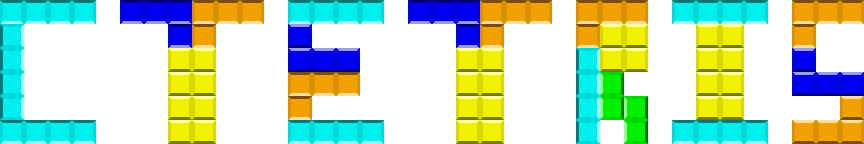
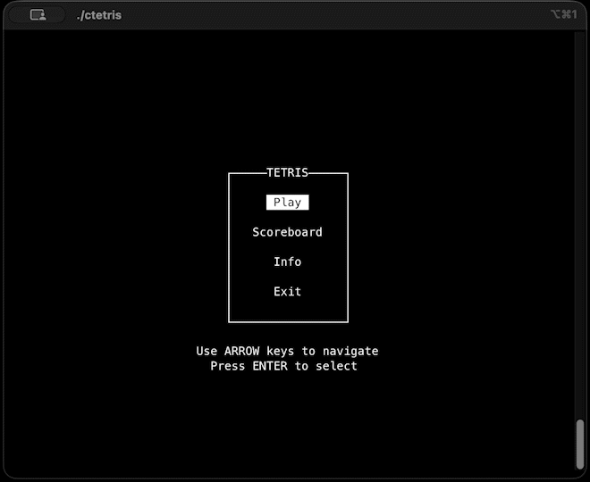

<!-- Source: https://github.com/othneildrew/Best-README-Template/ -->
<a id="readme-top"></a>
<!-- PROJECT LOGO -->
<br />
<div align="center">
  <a href="https://github.com/DiegoGomesDG/CTetris">
    
  </a>

<h3 align="center">CTetris</h3>

  <p align="center">
    A simple C terminal-based Tetris game
    <br />
    <a href="https://github.com/DiegoGomesDG/CTetris/issues/new?labels=bug&template=bug-report---.md">Report Bug</a>
    &middot;
    <a href="https://github.com/DiegoGomesDG/CTetris/issues/new?labels=enhancement&template=feature-request---.md">Request Feature</a>
  </p>
</div>


<!-- TABLE OF CONTENTS -->
<details>
  <summary>Table of Contents</summary>
  <ol>
    <li>
      <a href="#about-the-project">About The Project</a>
      <ul>
        <li><a href="#built-with">Built With</a></li>
      </ul>
    </li>
    <li>
      <a href="#getting-started">Getting Started</a>
      <ul>
        <li><a href="#prerequisites">Prerequisites</a></li>
        <li><a href="#installation">Installation</a></li>
      </ul>
    </li>
    <li><a href="#usage">Usage</a></li>
    <li><a href="#contributing">Contributing</a></li>
    <li><a href="#license">License</a></li>
    <li><a href="#disclaimer">Disclaimer</a></li>
  </ol>
</details>


<!-- ABOUT THE PROJECT -->
## About The Project
<p align="center">
  
</p>

CTetris is a terminal-based implementation of the classic Tetris game developed in the C programming language using the ncurses library. The project was created as part of the Basics of Programming 1 course at the Budapest University of Technology and Economics. Its main objective was to apply fundamental programming concepts such as structured programming, modular design, algorithm implementation, and file handling in the development of a fully functional interactive application.

The game features real-time gameplay, score calculation based on line clears and piece drops, a persistent leaderboard system with multiple sorting options, and file management for saving game results. Designed to run on macOS and Linux systems, CTetris demonstrates efficient terminal-based user interaction, clean program structure, and practical implementation of core computer science principles.


### Built With
* C programming Language
* ncurses library


<!-- GETTING STARTED -->
## Getting Started
Follow these steps to get a local copy running on your machine.

### Prerequisites
Before running CTetris, ensure your system has the following:
* C Compiler (e.g, `gcc`)
* ncurses library installed
  * On macOS (with [Homebrew](https://brew.sh))
  ``` sh
  brew install ncurses
  ```
  * On Linux
  ``` sh
  apt-get install libncurses5-dev
  ```

### Installation

1. Clone the repository
   ```sh
   git clone https://github.com/DiegoGomesDG/CTetris.git
   ```
2. Navigate into the project folder
3. Compile the game
   ```sh
   make
   ```
   Or, you can compile manually using `gcc`
   ```sh
   gcc -o ctetris src/main.c src/game.c src/menu.c src/scoreboard.c src/info.c -std=c99 -I include -Wall -lncurses
   ```

4. Run the game
   ```sh
   ./ctetris
   ```

<!-- USAGE EXAMPLES -->
## Usage
### Main Menu
The main menu contains the following options:
* Play – start a new game
* Scoreboard – view and sort your previous game scores
* Info – access a quick guide and control reference
* Exit – close the game

Use the <kbd>↑</kbd> and <kbd>↓</kbd> arrow keys to navigate the menu and <kbd>Enter</kbd> to select an option.

### Gameplay Controls
* <kbd>←</kbd> and <kbd>→</kbd>: Move the tetromino,
* <kbd>↑</kbd>: Rotate tetromino clockwise,
* <kbd>↓</kbd>: Soft drop (move tetromino down),
* <kbd>Space</kbd>: Immediately drop the tetromino, 
* <kbd>P</kbd>: Pause the game,
* <kbd>Q</kbd>: Exit the game,

### Scoreboard
CTetris automatically saves your game scores in a local scores.txt file in the project directory. Each entry records your points, cleared lines, and the date and time of the game.
The leaderboard displays your past games and can be sorted in four ways: Top Scores, Worst Scores, Most Recent, and Oldest. To change the sorting, use the <kbd>←</kbd> and <kbd>→</kbd> keys.

You can also delete all scores by pressing <kbd>D</kbd> and confirming with <kbd>Shift + Y</kbd>.

<p align="center">
  
</p>

### Remarks
* Do not resize the terminal window while playing.
* Avoid holding down keys continuously; pieces may not move correctly due to implementation details.


<!-- CONTRIBUTING -->
## Contributing
Contributions are what make the open source community such an amazing place to learn, inspire, and create. Any contributions you make are **greatly appreciated**.

If you have a suggestion that would make this better, please fork the repo and create a pull request. You can also simply open an issue with the tag "enhancement".
Don't forget to give the project a star! Thanks again!

1. Fork the Project
2. Create your Feature Branch (`git checkout -b feature/AmazingFeature`)
3. Commit your Changes (`git commit -m 'Add some AmazingFeature'`)
4. Push to the Branch (`git push origin feature/AmazingFeature`)
5. Open a Pull Request

<!-- LICENSE -->
## License
Distributed under the MIT License. See `LICENSE.txt` for more information.

## Disclaimer
This project is a clone of the original Tetris game, created by Alexey Pajitnov in 1984. The Tetris name and logo are trademarks of The Tetris Company. This version was developed as a personal project and is not affiliated with or endorsed by The Tetris Company. Its purpose is purely educational and to demonstrate fundamental programming concepts. 

For more information about Tetris and its trademarks, please visit the official website of [The Tetris Company](https://tetris.com).

<p align="right">(<a href="#readme-top">back to top</a>)</p>

